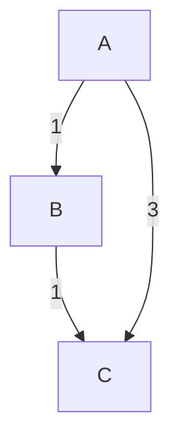
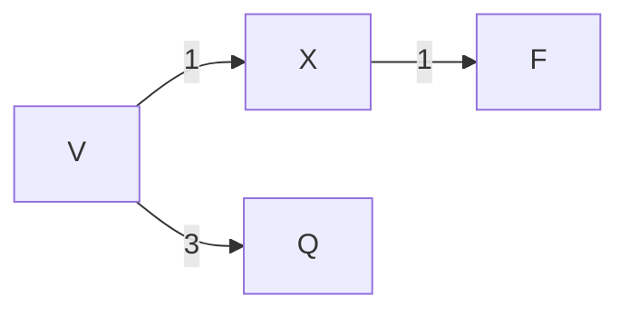

>[!Question] The Problem
>Given a directed positively weighted graph, and a starting node v, find  the shortest path to travel from v to all vertices.

# Independent trials

Let's try to attack this problem by finding just the shortest path between a pair of vertices $(v,w)$.

![[Pasted image 20230131201753.png]]

Denote the group of vertices except v and w as S.
We can classify all the edges in the graph into 6 categories:
1. from v to S
2. from S to v
3. from S to w
4. from w to S
5. from v to w
6. from w to v

What edges cannot be included in the shortest path from v to w? Answer is simple: all edges starts from w. We immediately eliminate 2 categories. As well, from S to v is also impossible, as it goes back to the source with no gain.

Thus, the shortest path can only contains edges from v to w, from v to S and S to w.

From v to w is trivial. We then consider is there a path, from v to S to w, is shorter than the direct edge $(v,w)$.

In other words, we are finding a pair of vertices in S, p and q, such that, the following is minimised: 
$$dist(v,p) + SD(p,q) + dist(q,w)$$
Note that $p=q$ is possible.

We need to state the induction hypothesis carefully:

>[!Note] Induction Hypothesis
>Given a directed graph $G={V,E}$ where $|V|=n$, we know how to find the shortest distance between any 2 vertices if $|V|<n$.

For our problem, we can ignore v and w, and use the induction hypothesis to find the shortest distance between any 2 vertices in S.

Then for each pair of vertices in S, we calculate the above value, remembering the minimum pair, and compare it with the edge $(v,w)$.

There is one problem though, that is we need to calculate the shortest distance between any 2 nodes to complete the proof, which we could do, by repeating the above procedures for all pairs in $G$, but you can see this is very inefficient.

# Dijkstra's Algorithm

The key is to identify the order of vertices for finding the shortest path. If we start at vertex v, should we find the shortest path to w first? Or x,y,z first? As the shortest path to a node can affect the shortest path of another node.

- Without B, $SD(A,C) = 3$
- With B, $SD(A,C) = 1+1 = 2$

What kind of node will affect the shortest path of another node? Assume we can label the nodes with labels 1 to n, and we start at node 1. 

Obviously, $SD(1,1) = 0$. Assume we know $SD(1,i)$ for all i, we can sort the nodes ascendingly according to their shortest distance from v.

Can a node further from v affects the distance of a node that is closer to  v? The answer is NO!

>[!Question] Question
>Given $SD(v,p) > SD(v,w)$, can vertex p affects $SD(v,w)$? 
>
>"Affect" means whether the existence of p would cause a difference in $SD(v,w)$.

Assume it does, that means adding p to the graph had created a new path including p such that the distance from v to w is shortened. p is in the path, let this new path be $P$. 

We now claim that within $P$, the distance from v to p is $SD(v,p)$. As if it isn't so, we can replace this part of $P$ with a shorter path with $SD(v,p)$.

Then, the length of $P = SD(v,w) = SD(v,p)+SD(p,w) > SD(v,p)$, given that no path can have zero length. Here we can see the contradiction. We conclude that if $SD(v,p)>SD(v,w)$, v must not in the shortest path from v to w.

This implies that we can safely find the $SD(v,w)$ without knowing $SD(v,p)$. Then the order of finding the $SD$ is clear, that is simply following the order of $SD$.

But the question is, we don't know the order of $SD$! Luckily, we don't need to know the full order of $SD$ during the execution of the algorithm. We only need to know, **which node is closest to v**.

Starting at v, the closest node is v itself, and we can be sure that SD is zero. 

> No nodes can affect the shortest distance from v to v(which is 0), as v is closest to v.

So we can fix SD(v,v), and find the next closest node to v, what are the possible candidates?

Can it be the nodes other than the neighbour of v? No it cannot, as the path must include the neighbour of v, which is closer to v already. Therefore the possible candidates are the neighbours of v.

Follows from that, the second closest node would be the closest neighbour to v, call it x, where the SD is the edge length from v to x.

> No nodes other than v can affect the shortest distance from v to x, as x is the closest to v except v.

Then we can fix SD(v,x). Again, we need to find the next closest node to v. Would the candidates simply be the remaining neighbor of v? Again No! It could also be the neighbour of x but not v.

- The next closest node is F, instead of Q.

We start to see a general pattern:
1. We maintain the **known shortest distance from v to each node, initialised as infinity (v to v is 0)** 
2. In every iteration, we find the unfixed node w closest to v, fix it.
3. For each neighbour x of w, we update their known shortest distance by SD(v,w) + dist(w,x), if it is shorter than the known distance.

Step 1 and 3 cannot be compressed further, while step 2 has room for optimization. Finding the unfixed node w closest to v would require the algorithm to search for the node with the **minimum known SD**.

This problem is same as finding the minimum item in a set which could be done by using a priority queue, such as [[Heap]].

