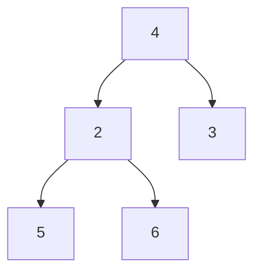
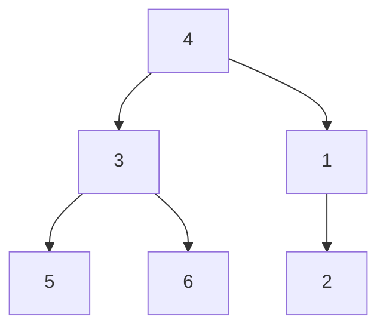

My own definition for a heap is a complete binary tree plus some additional properties.

2 kinds of heap:
1. Min-heap
2. Max-heap

>[!Note]  Min Heap
>The upper element is smaller

>[!Note] Max Heap
>The upper element is larger

# Heapify

To prove the correctness, we can take a recursive approach.

Imagine we divide the binary tree into 3 parts: root, left subtree, right subtree.

Assume we know how to turn the subtree into heaps.

>[!Note] Assumption
>We know how to transform an array with size < N into a heap.

Now, the only problem is to move the root to the correct place.

If any of the children of the root is smaller, swap it with the smaller child such that we don't need to swap this level again, and repeat the process.

The maximum number of swaps can happen is the height of the tree, which is bounded by $\lfloor \log N \rfloor$.

What is the time complexity of this process?We have the recurrence:

>[!Note]
>$$T(N) \le 2T(\frac{N}{2}) + \log N$$

By master theorem, we can claim that $T(N) = O(N)$.

>[!Note] 
>Heapifying is a pretty fast process!

## Implementation

Although recursion is nice for logical induction, it requires a lots of stack memory in implementation, therefore, one should always seek for an iterative approach.

Think about the order, usually iterative approach is a bottom up method. Why? Think about the last recursive call, what is the parameter subtree? Surely the bottom nodes. Therefore, we need to deal with them first, then level by level up.

That is, we ensure the last k levels does not have any node violates the heap properties, and we deal with the last k+1 level.

At level 0, we have 1 subtree (nodes).
At level 1, we have 2 subtrees.
At level i, we have $2^i$ subtrees.

At each level, for each node, we need to ensure it is smaller than its 2 children, once we found any node violating this, we sink the node down to where it supposes to be.

Therefore, for each node, we need at least 2 comparison.
1 for finding the smaller child, 1 for checking if the root is even smaller.
If true, than good, nothing needs to be done.
If false, than swap the root with the smaller child.

Here, we can feel there is some redundancy, that is comparing the children repeatedly.

Consider a tree like the following:


With the old algorithm:
1. 5 vs 6, 5 smaller
2. 2 vs 5, 2 smaller, good
3. 2 vs 3, 2 smaller
4. 4 vs 2, 2 smaller, swap 4 and 2
Now, since we didn't record whether 5 or 6 is smaller, we need to compare them again! This is bad.

What if we somehow remember that 5 is smaller? By adding one property to our heap:

>[!Note] New property
>Left child is smaller than right child

With this new algorithm, whenever we check which subtree is smaller, we need to swap two subtrees if needed.



For example, we need to swap 3 and 1 when we compare them. Notice that we need to swap the whole subtree, not just the element itself, otherwise 3 and 2 will break the basic heap property:


Therefore, this new property is incompatible with the array implementation, we need to create a binary tree structure in memory, and swap the pointers.

>[!Question] Brainstorm
>Think about the complete binary tree assumption. After swapping it will no longer be a complete binary tree. Will it become a problem?

Although we save almost half of the comparison by this new property, we need to create explicit memory to handle the subtree swaps, which is not economical. Therefore better give up this idea.

## Practice

```c
#include <stdio.h>
#include <math.h>

//parameter is an array with its length N
void heapify(int* arr, int N){
	//calculate its height
	int h = log(N)/log(2);

	for(int i=h;i>=0;i--){
		//At level i, there are 2^i nodes at max
		//index of the leftmost node at level i = 2^i - 1
		int start = pow(2,i)-1;
		int ptr = start;
		while(ptr<start + pow(2,i) && ptr < N){
			int left = 2*ptr + 1;
			int right = 2*ptr + 2;
			if(left < N){
				int smaller = left;
				if(right < N){
					if(arr[right] < arr[left]){
						smaller = right;
					}
				}
				if(arr[ptr]>arr[smaller]){
					sink(arr, ptr, N);
				}
			}
			ptr++;
		}
	}
}

void sink(int* arr, int ptr, int N){
	int smaller = ptr;
	if(2*ptr+1<N){
		smaller = left;
		if(2*ptr+2<N && arr[2*ptr+1]>arr[2*ptr+2]){
			smaller = right;
		}
	}
	while(arr[ptr]>arr[smaller]){
		int t = arr[ptr];
		arr[ptr] = arr[smaller];
		arr[smaller] = t;

		smaller = ptr;
		if(2*ptr+1<N){
		smaller = left;
		if(2*ptr+2<N && arr[2*ptr+1]>arr[2*ptr+2]){
			smaller = right;
		}
	}
}
```
