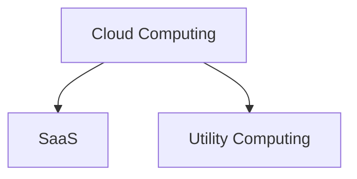

SaaS, Software as a Service, means the software are no longer a mechandise that the user has to pay to own and then run, instead, it's a service.

Utility Computing, is the service being sold. Computing resources are treated as utility, like water and electricity. Pay as you go.

- Private cloud is not cloud computing.

>[!Note] Architecture
>SaaS run on top of the Cloud, which can be treated as application software run on top of OS and hardware.

## Advantages of cloud
1. No need for plan far ahead
2. No up front commitment
3. Release redundant resources

## Abstraction of the Cloud

### Examples of low abstraction
- AWS EC2 VMs, can control from the kernel upwards. Low level make it difficult for Amazon to offer automatic scalability and failover.

## Examples of high abstraction
- Google AppEngine, stateless computation tier and stateful storage tier.

## Examples of middle abstraction
- Microsoft's Azure

# Cloud Computing

>[!Definition] Definition
>App delivered as services over the Internet and the hardware and systems software in the datacentrs that provide those services.

