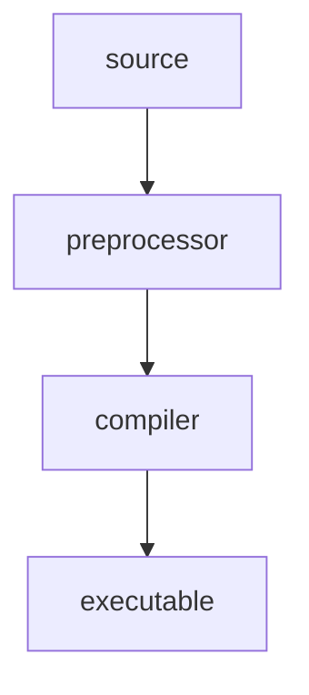
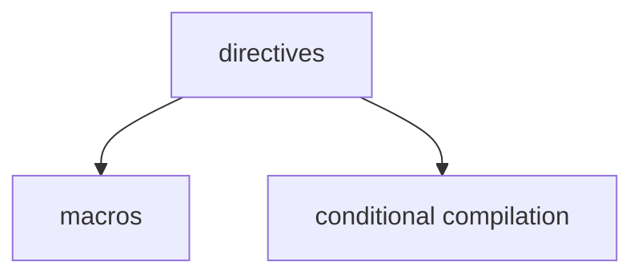

>[!Definition] Definiton
>Preprocessing  is something that allows you to engineer and modify your source code before submitting it to the compiler.



> **C directives** controls the behavior of the C preprocessor. They start with a # character in both header and source files.



# Macros

Useful for:
1. Defining constant
2. Use as a function
3. Loop unrolling
4. Header guards
5. Code generation
6. Conditional compilation

## Defining a macro

```c++
#define ABC 5
int main(int argc, char** argv){
	int x = 2;
	int y = ABC;
	int z = x + y;
	return 0;
}
```

- `ABC` is not a variable but a macro.
It can be undefined with `#undef`:
```c++
#define A 3
int main(){
    #undef A
    int a = A;
    return 0;
}
```
- The compiler will treat `A` as an identifier, which is undefined.

## Function-like macro
```c++
#define ADD(x,y) x+y
int main(){
	int x = 2;
	int y = 3;
	int z = ADD(x,y);
	return 0;
}
```

The preprocessor will analyse the `#define` statement, it can see `x` and `y` exists in the `()` and its definition `x+y`, it knows that it needs to replace them.

>[!Key] Common misconception
>The compiler actually knows about directives. It can point out the compilation error is from the macro expansion.

> `gcc -E src.c` can be used to show the preprocessed code. `E` for expansion.

>[!note] Translation unit
>The preprocessed C code that is ready to be passed to the compiler. We can say that `gcc -E src.c` can be used to show the translation unit.

## Domain Specific Language

We can design DSL for our purpose.
```c++
#define LOOP(v,s,e) for (int v = s; v <= e ; v++)
#define ENDLOOP }
```

## # operator
> Replace the argument with string

```c++
#define toString(param) #param
```

Then `toString(abc)` will be translated to `"abc"`.

## ## operator
> Concatenate the argument with other string

```c++
#define concat(param) prefix_ ## param ## _suffix
```

Then `concat(abc)` will be translated to `prefix_abc_suffix`.

## Variadic macros
