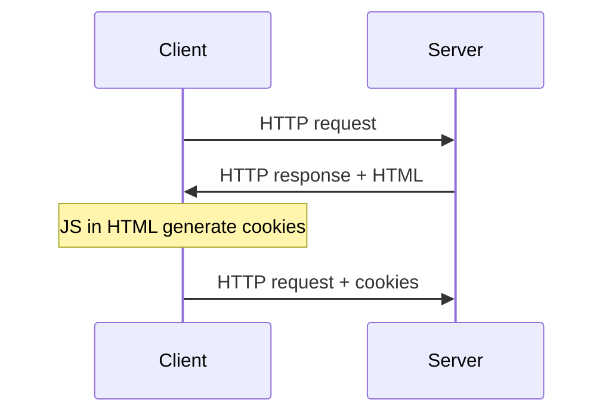
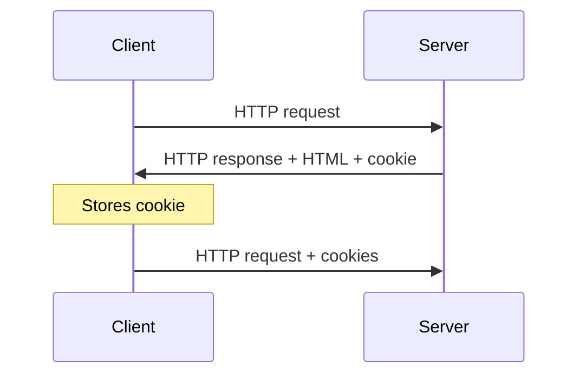
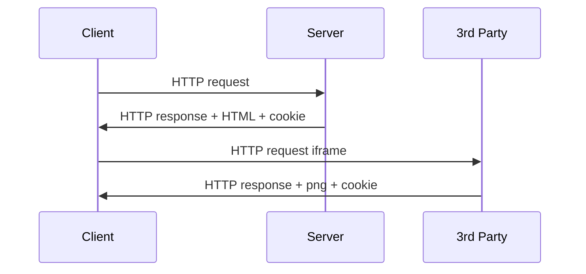

#webdev 


# Browser Generated



Cookies is a  key value pair.

## Create/ Update

```js
document.cookie = "month=2";
```

## Read
```js
document.cookie //return "month=2" as well as other cookies
```

## Delete
```js
document.cookie = "month=2;expires=Thu, 01 Jan 1970 00:00:00 GMT";
```
- By default, cookies are deleted right after you closed the browser.


# Server Generated



## Third Party Cookies

```html
<iframe src="https://thirdparty.com/ad.html" height="0" width="0"></iframe>
```



## Express
Need to install `cookie-parser`
```js
const cookieParser = require("cookie-parser");
app.use(cookieParser());

//create cookie in AJAX 
app.get("/",(req,res)=>{
	const {username} = req.cookies;       //read
	res.cookie("username","new value");   //update
	res.cookie("username");               //clear
})
```

## Session

The cookie can be used to identify user, which is called a session.
The server use the session ID as a key to its key-value storage, where the value is all user-specific data.

>[!Note] Session ID
>The value of the session cookie, unique among the browser sessions.

### Express-session

Install `express-session`

```js
const session = require("express-session");
app.use(session({
	secret: "secretkey",
	resave: false,
	saveUninitialized: false,
	rolling: true,           
	cookie: {maxAge: 300000} //lifetime in ms
}));


app.post("/signin",(req,res)=>{
	const {user} = req.body;
	req.session.name = user;
});

app.get("/signout",(req,res)=>{
	req.session.destroy(); //delete the whole session data
	delete req.session.name; //delete only the field
})
```
