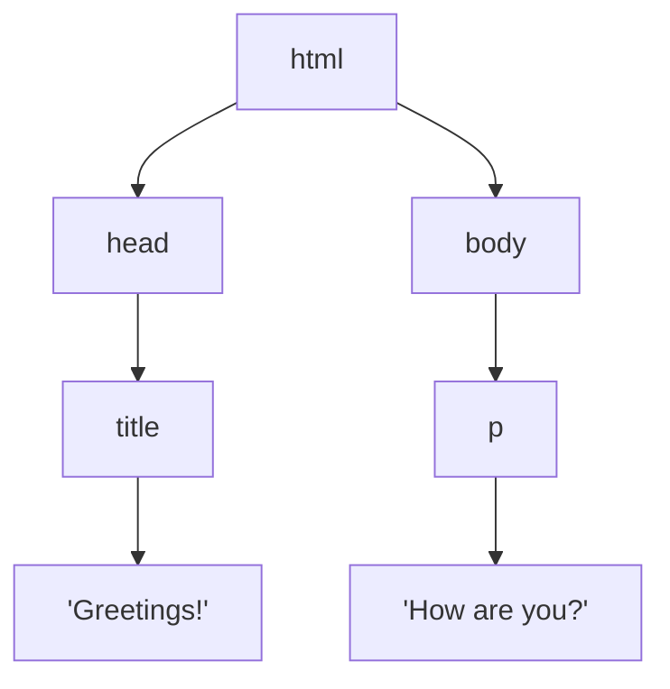
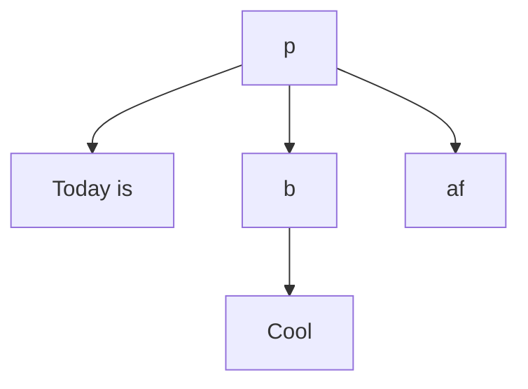

When a web page loaded in a brower, it is stored in memory using a tree structure. It can be manipulated with Javascript.


[Use this to visualize any website](http://bioub.github.io/dom-visualizer/)

# Nodes in DOM

## Root node

```js
let root =  document.documentElement;
```

## DOM nodes

### Element nodes
Examples are:
- title
- p

### Text nodes
Some element has a text node under it to store text.

```html
<p> Today is <b> Cool </b> af </p>
```


# DOM Manipulation
The JQuery counterpart.

## Get Element
### By ID
`let node = document.getElementById("element_id")`
### By Tag
`let node = document.getElementByTagName("h1")`

## Changing Properties
### innerHTML
`node.innerHTML = "Yo"`
### style
`node.style.backgroundColor = "red"`


# DOM Traversal 

```js
//UP
node.parentNode;
//Down
node.childNodes[]; //return a list of all children nodes
node.firstChild;
node.lastChild;
//Left
node.previousSibling;
//Right
node.nextSibling;
```


# DOM Events

## onload event
Define the callbacks in the style section
```html
<script>
function show(){
	alert("Show!");
}
</script>
```
Apply the callback
```html
<body onload="show()"> ... </body>
```

## onclick event
```html
<body onclick="show()"> ... </body>
```
