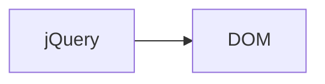
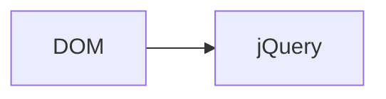

#webdev 

Import the library in html
`<script src="https://code.jquery.com/jquery-3.6.1.min.js"></script>`

# DOM Maniputlation
Compare with: Document Object Model#DOM Manipulation

## Get Element
Document Object Model#Get Element
### By ID
`let node = $("#element_id")`
### By Tag
`let node = $("h1")`
### By Class
`let node = $(".class")`

>[!Note] CSS Selector
>`#element_id` and `h1` are called *CSS Selectors*, which can be used to select elements.

>[!Tip] jQuery Object
>The return value of above statements are not DOM elements, but jQuery Objects.

## jQuery Objects Properties
Compare with: Document Object Model#Changing Properties

### html
Document Object Model#innerHTML

| Action | code                |
| ------ | ------------------- |
| Read   | `node.html()`       |
| Write  | `node.html("Text")` |

### Comparison between .html and .text

| function | Usefulness                    |
| -------- | ----------------------------- |
| .html    | can read and create HTML tags |
| .text    | can read and create text      |

>[!Tips] Teaching HTML tags
>If you want to display HTML tags like `<h1>` in content, you can use `.text()`.


### length
Count the number of elements in a jQuery object.

For example, when we have two `a` elements in the DOM.
```js
let nodes = $("a");
nodes.length; //equals to 2
```

## attr

| Action | code                               |
| ------ | ---------------------------------- |
| Read   | `nodes.attr("attr_name")`          | 
| Write  | `nodes.write("attr_name","value")` |

Read the specified attribute of the first element in the jQuery object.
Write the value to all elements in the jQuery object.

Continue with the above example.
```js
nodes.attr("href"); //equals to the link of the first <a>
nodes.attr("href","new link here")
```

>[!Tips] Asymmetry Here
>While read only affects the first element in the list, write will affect all elements.


## css
Compare with: Document Object Model#style

| Action | code                        |
| ------ | --------------------------- |
| Read   | `nodes.css("color")`        |
| Write  | `nodes.css("color","blue")` |

Read the specified css property of the first element in the jQuery object.
Write the value to all elements in the jQuery object.

# Conversion to DOM element


`let domElement = $("h2")[0];`


`let jqObj = $(domElement);`


# jQuery Event

## Ready Event
Document Object Model#onload event
Called when the object finishes loading
```js
$(document).ready(...);
```

## Display Event
Change the css property display.
```html
<p id="1" style="display:none">Cannot see</p>
<p id="2" style="display:block">Can see</p>
```

### Show and Hide
```js
$("#1").show();
$("#2").hide();
```
Or simply
```js
$("p").toggle(); //#1 will show, #2 will hide
```
You can even decide the animation duration
```js
$("p").toggle(500); //500ms
```
#### Special Effects

| Effect | code                                  |
| ------ | ------------------------------------- |
| fade   | fadeIn(), fadeOut(), fadeToggle()     |
| slide  | slideDown(), slideUp(), slideToggle() |


## Other Events
Document Object Model#onclick event
The advantage is you will apply the event callbacks to all elements at once.
```js
$("a").on("click", ...);
```
