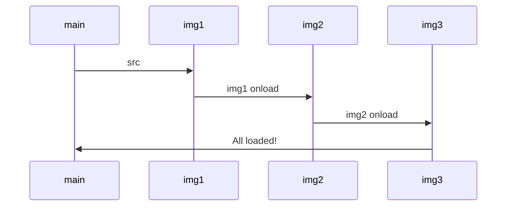

#webdev 

# Timers
There are two important functions in javascript.
1. `setTimeout()`
2. `clearTimeout()`

You can use it to create regular call of function:
```js
let callback = ()=>{
	console.log("called");
	setTimeout(callback,5000);
};
//regularly call callback for every 5 seconds
let timer = setTimeout(callback,5000);
//stop the loop after 20 seconds
setTimeout(()=>{clearTimeout(timer)},200000);
```

Or using `setInterval`
```js
let callback = ()=>{console.log("called");}
let timer = setInterval(callback,5000); 
setTimeout(()=>{clearInterval(timer)},200000);
```

# Sound

```js
const song = new Audio("music.mp3");

song.currentTime = 0;
song.play();

song.pause();
```

>[!Tips] CORS policy
>Auto playing is not allowed, you can only play music after user initiated events.

# Promise

## Evolving 
Load images in sequence.



### Callbacks

```js
const img1 = new Image(),
	  img2 = new Image(),
	  img3 = new Image();

img1.onload = function(){
	img2.onload = function(){
		img3.onload = function(){
			console.log("All loaded!");	
		}
		img3.src = "img3.png"
	}
	img2.src = "img2.png"	
}
img1.src = "img1.png";
```

### Promise

```js
const img1 = new Image(),
	  img2 = new Image(),
	  img3 = new Image();

img1.src = "img1.png";
const img1P = img1.decode();
img1P.then(()=>{
	img2.src = "img2.png";
	return img2.decode();
}).then(()=>{
	img3.src = "img3.png";
	return img3.decond();
}).then(()=>{
	console.log("All loaded!");
}).catch((error)=>{
	console.log("error");
});
```


### Async/Await

```js
const img1 = new Image(),
	  img2 = new Image(),
	  img3 = new Image();

//return a promise
function loadImage(img,path){
	img.src = path;
	return img.decode();
}

//this function returns a promise by async
async function loadAllImage(){
	await loadImage(img1,"img1.png");
	await loadImage(img2,"img2.png");
	await loadImage(img3,"img3.png");
}

loadAllImage().then(()=>{
	console.log("All loaded");
}).catch((err)=>{
	console.log("err");
});
```


## Parallelism

```js
const promises = [
	loadImage(img1,"img1.png"),
	loadImage(img2,"img2.png")
];

Promise.all(promises)
	.then(()=>{console.log("All loaded")}})
	.catch((err)=>{console.log(err)})
```

# Basic
```js
//string to number
parseInt("123");
//Not a number test
isNan("abc")==true;
//variable without declaration
no_var_let_const = "is a global variable"
//Array functions
array.length
array.splice(1,2,6); //delete 2 element starting at index 1, insert 6 at index 1
array.splice(3,1); //delete 1 element starting at index 3
for(const element of arr){...}
for(const key in obj){...}
item1, item2 = ...arr; //arr = [1,2]
[...arr, 3,4] == [1,2,3,4]
{a:1, ...bandc} == {a:1,b:2,c:3} //bandc = {b:2, c:3}
					  
```
