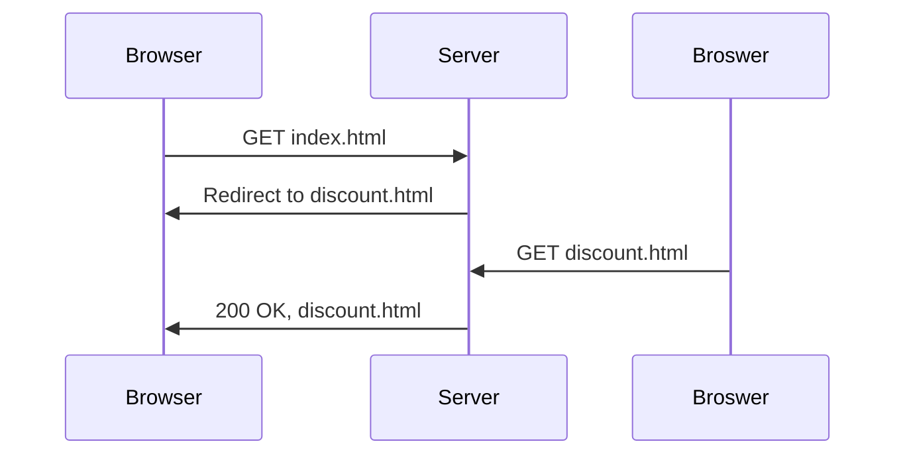

> It is for building low coupling, easy maintanence Multi Page Application.

# MVC file structure
- project/
	- server.js
	- controllers/
		- front_controller.js
		- stock_controller.js
	- models/
		- stocks.js : return API data
	- views/
		- table.ejs
		- welcome.ejs
		- chart.ejs
	- public/
		- css/
			- stock.css
		- js/
			- chart.js

Node.js module
```js
//in count.js
let count = 0;
const increase = ()=>{count ++;}
module.exports = {increase,get}
//in main.js
const counter = require("./counter");
counter.increase();
```


## HTTP Redirect


Redirect HTTP Response
```http
HTTP/1.1 302 Found
Location: http://money.com       
...
```
- Location can also be relative path 
- 301: permanently moved, 304: use your locally cached page

```js
app.get("/", (req,res)=>{
	res.redirect("http://money.com"); //to another page
	res.redirect("/signin"); //a folder is a page
})
```


# View
## Template Engines

> An alternative to PHP to return dynamic page (mix code and HTML)

install `ejs`
```js
app.set("view engine", "ejs");
```

### EJS Syntax

| Special header | function        |
| -------------- | --------------- |
| `<%     %>`    | enclose js code |
| `<%=    %>`     |  display the value of the js expression               |

Example of ejs
```ejs
<!DOCTYPE html>
<html>
<head><title>Welcome!</title></head>
<body>
	<%= "Welcome to my page!" %>
</body>
</html>
```

### File structure for ejs

- server.js
- views
	- view1.ejs
	- view2.ejs

### Server side
returning a view to browser
```js
res.render("view1"); //return the view1.ejs
res.render("view2", {name: "Kelvin"}) //pass input to ejs, name can directly use in ejs file
```
`<%= name %>` will display Kelvin.


# Model

> A model is a piece of javascript code that acquire data from a variety of data sources: file, database, API. Usually the acquire function is async.

```js
//in stock.js
async function getStock(code){
	const data = await ...;
	return data;
} //returns a promise
//in controller
const stocks = require("../models/stocks")
stocks.getStock("AAPL")
.then(data=>{...})
.catch(err=>{...})
```

# Controller

> A controller is a javascript module that groups several AJAX handler functions with related functionality together. 

```js
//in authController.js
const signIn = (req,res)=>{...};
const signOut = (req,res)=>{...};
module.exports = {signIn, signOut};
//in server.js
const authController = require("../controllers/authController");
app.post("/signin", authController.signIn);
app.post("/signOut", authController.signOut);
```
