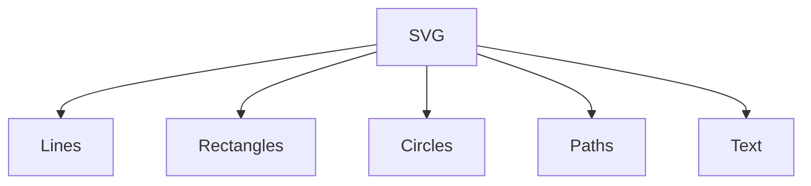

#webdev 



>[!Tips] Defaults
>`stroke` and `stroke-width` will be 0, no stroke.
>`fill` will be black, set `none` to get transparent.


# Line
```html
<line x1="10" y1="10" x2="100" y2="100" stroke="red" stroke-width="5" />
```

# Rectangle

`rect`
1. x
2. y
3. width
4. height
5. stroke
6. stroke-width
7. fill
8. rx
9. ry

# Circle

`circle`
1. cx
2. cy
3. r
4. stroke
5. stroke-width
6. fill

# Text
```html
<text x="50", y="100" font-size="30" fill="navy" font-family="monospace">
Yooooo </text>
```

# Path
`path`
## Commands

| Code | Meaning               |
| ---- | --------------------- |
| M    | Move to               |
| L    | Draw line to          |
| H    | Horizontal line to    |
| V    | Vertical line to      |
| Z    | Finish/ back to start |

>[!Tip] Absolute coordinate
>Using capital letters means relative to the canvas, lowercase means relative to the previous point.

## Example

```html
<path d="M100,25 
		 L200,25
		 L250125
		 L50,125
		 Z",
fill="pink", stroke="black"/>
```

# Example 
<svg xmlns="http://www.w3.org/2000/svg" version="1.1" width="800" height="800" viewBox="0 0 800 800">
        <ellipse cx="400" cy="400" rx="200" ry="190" fill="#FFEBCD" />
        <ellipse class="nose" cx="400" cy="420" rx="60" ry="50" fill="red" />
        <circle class="nose" cx="290" cy="420" r="50" fill="red" />
        <circle class="nose" cx="510" cy="420" r="50" fill="red" />
        <ellipse cx="340" cy="340" rx="20" ry="30" fill="black" />
        <ellipse cx="460" cy="340" rx="20" ry="30" fill="black" />
        <path stroke="black" stroke-width="5px" d="         M310,480 C350,530 450,530 490,480" fill="none" />
        <path stroke="black" stroke-width="5px" d=" M310,300 C320,260 360,260 370,300" fill="none" />
        <path stroke="black" stroke-width="5px" d="M430,300 C440,260 480,260 490,300" fill="none" />
    </svg>
   