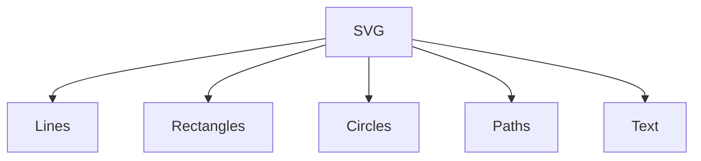

#webdev 



>[!Tips] Defaults
>`stroke` and `stroke-width` will be 0, no stroke.
>`fill` will be black, set `none` to get transparent.

# Objects
## Line
```html
<line x1="10" y1="10" x2="100" y2="100" stroke="red" stroke-width="5" />
```
## Rectangle
`<rect/>`:  x, y, width, height, stroke, stroke-width, fill, rx, ry
## Circle
`<circle/>`: cx, cy, r, stroke, stroke-width, fill
## Text
```html
<text x="50", y="100" font-size="30" fill="navy" font-family="monospace">
Yooooo </text>
```
## Path
```html
<path d="M100,25 L200,25 L250125 L50,125 Z", fill="pink", stroke="black"/>
```

| Code | Meaning               |
| ---- | --------------------- |
| M    | Move to               |
| L    | Draw line to          |
| H    | Horizontal line to    |
| V    | Vertical line to      |
| Z    | Finish/ back to start |

>[!Tip] Absolute coordinate
>Using capital letters means relative to the canvas, lowercase means relative to the previous point.

# Group

> Can be used to group svg objects and apply css properties at once. 

```html
<g id="#id">...</g>
<script> $("#id").css("opacity","0.5")</script>
```

# Gradient

## Linear gradient
```html
<defs>
	<linearGradient id="id"
	x1="0%" y1="0%" x2="100%" y2="100%">
	<!--start at top-left, end at bottom-right-->
		<stop offset="0" stop-color="red" />
		<stop offset="0.5" stop-color="orange" />
		<stop offset="0.9" stop-color="violet" />
	</linearGradient>
</defs>
<... fill="url(#my_gradient)" .../>
```
## Radial gradient
```html
<defs>
	<radialGradient id="id"
	fx="60%" fy="60%" cx="20%" cy="30%" r="80%">
	<!--start at top-left, end at bottom-right-->
		<stop offset="0" stop-color="red" />
		<stop offset="1" stop-color="violet" />
	</radialGradient>
</defs>
<... fill="url(#my_gradient)" .../>
```