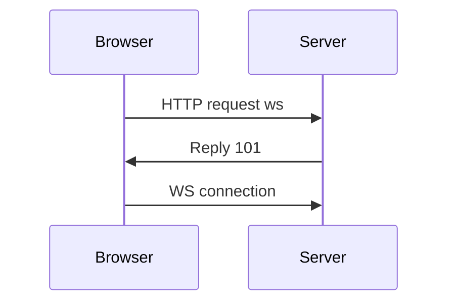

#webdev 

# Client Pull

> Update is always initiated on the browser side

Problems
1. client read twice before server update is finished
2. the http request has high overhead
3. browser cannot initiate update

# WebSocket


```
// request for ws
...
Connection: Upgrade
Upgrade: websocket
...

// reply to browser
HTTP/1.1 101 Switching Protocols
Upgrade: websocket
Connection: Upgrade
```

## Socket.io

Server side:
install `socket.io`
```js
const {createServer} = require("http");
const {Server} = require("socket.io");
const httpServer = createServer(app);
const io = new Server(httpServer);

io.on("connection",socket=>{
	io.emit("event","text message");
	socket.emit("event","text message");
	socket.on("event",message=>{...});
	socket.on("disconnect",reason=>{...})
});

httpServer.listen(8000);
```

Broswer side:
import socket.io
```html
<script src="/socket.io/socket.io.min.js"></script>
```
script
```js
const socket = io();
socket.emit("event","msg");
socket.on("event",msg=>{...})
socket.disconnect();
```