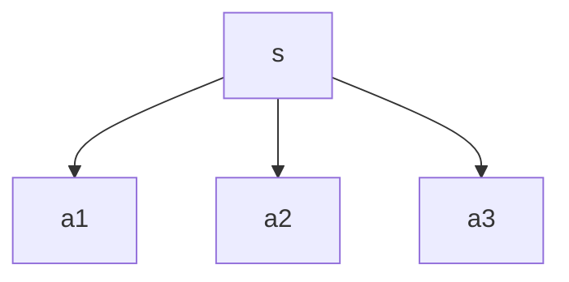

#reinforcement-learning

>[!NOTE] Definition
>$$q_{\pi}(s,a) = \mathbb{E}_{\pi}[G_t | S_t = s, A_t=a]$$

It is the expected return if an agent start at state s, and decided to take action a.

## Connection with the State-value function

It is good to compare this with the [[State-value function]].

Each *q-state* has its own *q-value* $q_\pi(s,a_i)$. Using backpropagation (from Game theory), the expected return at $s$ would be the average of all the *q-values*.

$$v_\pi(s) = \sum_a q_\pi(s,a) \pi(a|s) = \mathbb{E}_\pi[q_\pi(s,a)| S_t = s]$$

## Bellman Expectation Equation

Action-value function too has a bellman version, see the derivation [[Bellman Expectation Equation#Action-value function|here]].

