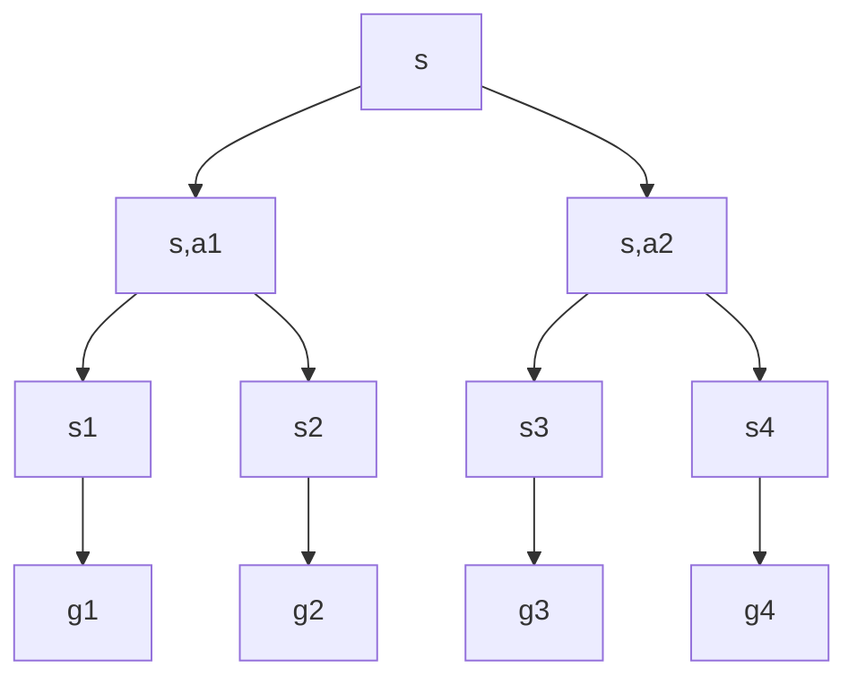

#reinforcement-learning 

This equation is related to the [[State-value function]] computation.

We start from the definiton
$$v_{\pi}(s) = \mathbb{E}_\pi[G_t|S_t=s]$$
Then we substitute the definition of $G_t$
$$\mathbb{E}_\pi[R_{t+1}+ \gamma R_{t+2} + \gamma ^2R_{t+3} + ...|S_t=s]$$
Then we regroup the terms
$$\mathbb{E}_\pi[R_{t+1}+ \gamma (R_{t+2} + \gamma R_{t+3} + ...)|S_t=s]$$
We notice that $G_{t+1}$ exists in the expression
$$\mathbb{E}_\pi[R_{t+1}+ \gamma G_{t+1}|S_t=s]$$
Expectation is linear, therefore we have
$$\mathbb{E}_\pi[R_{t+1}|S_t=s]+ \gamma\mathbb{E}_\pi[ G_{t+1}|S_t=s]$$
The first term $\mathbb{E}_\pi[R_{t+1}|S_t=s]$, we can expand like so
$$\sum_{a}\sum_{s',r} r P(s',r|s,a)\pi(a|s)$$
- Given current state, choosing action 
- Given state-action, choosing nextstate-reward pair

Now think about $\mathbb{E}_\pi[ G_{t+1}|S_t=s]$, given the current state, what is the expectation of the return at next state? What do we know about the next state?
$$\sum_{g} g P(g|s)$$
- we sum over all possible values of $G_{t+1}$

Refering to the graph, the expected $G_{t+1}$ given $s$ should be:
$$\sum_{a} \sum_{s',r} \sum_{g} g P(g|s',r)P(s',r|s,a)\pi(a|s)$$
Now let's consider $\sum_{g} g P(g|s')$, it is the expected value of $G_{t+1}$, given that $S_{t+1} = s'$. This is exactly the state-value at $s'$! So we can simply the expression:
$$\sum_{a} \sum_{s',r} v_{\pi}(s')P(s',r|s,a)\pi(a|s)$$
Now we combine two terms:
$$\sum_{a}\sum_{s',r} r P(s',r|s,a)\pi(a|s) + \gamma\sum_{a} \sum_{s',r} v_{\pi}(s')P(s',r|s,a)\pi(a|s)$$
$$=\sum_{a}\sum_{s',r}\left[ r +\gamma v_\pi(s') \right] P(s',r|s,a)\pi(a|s)$$
- We iterated over all actions, nextstate-reward pairs, only keeping current state fixed.
$$\mathbb{E}_\pi[r+\gamma v_\pi(s') | S_t=s]$$

# Action-value Function

This is related to the [[Action-value function#Connection with the State-value function|action-value function]].

From the definition
$$q_{\pi}(s,a) = \mathbb{E}_\pi[G_t|S_t=s, A_t = a]$$
$$\mathbb{E}_\pi[R_{t+1}+ \gamma G_{t+1}|S_t=s,A_t=a]$$
Expand the formula
$$\sum_{s',r}(r + \gamma \sum_g gP(g|s'))P(s',r|s,a)$$

We can do the following:
$$\sum_g gP(g|s') = \sum_{a'}\sum_g gP(g|s',a') = \sum_{a'} q_\pi(s',a')$$
Do the substitution:
$$\sum_{s',r}(r + \gamma \sum_{a'}q_\pi(s',a'))P(s',r|s,a)$$
And we obtain:
$$\mathbb{E}_\pi[r+\gamma q_\pi(s',a')|S_t=s,A_t=a]$$