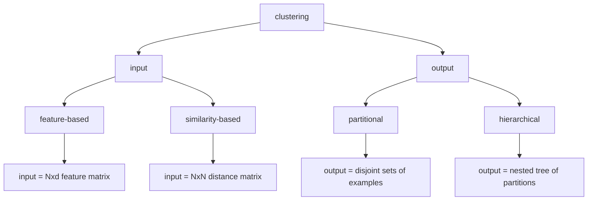
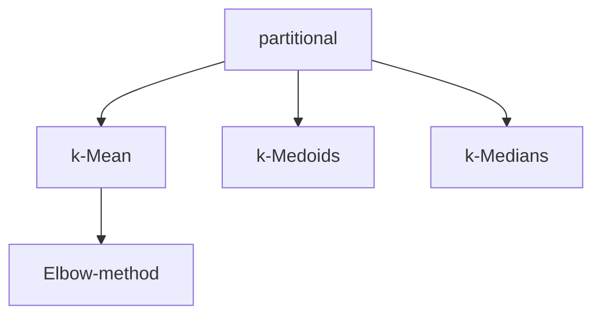
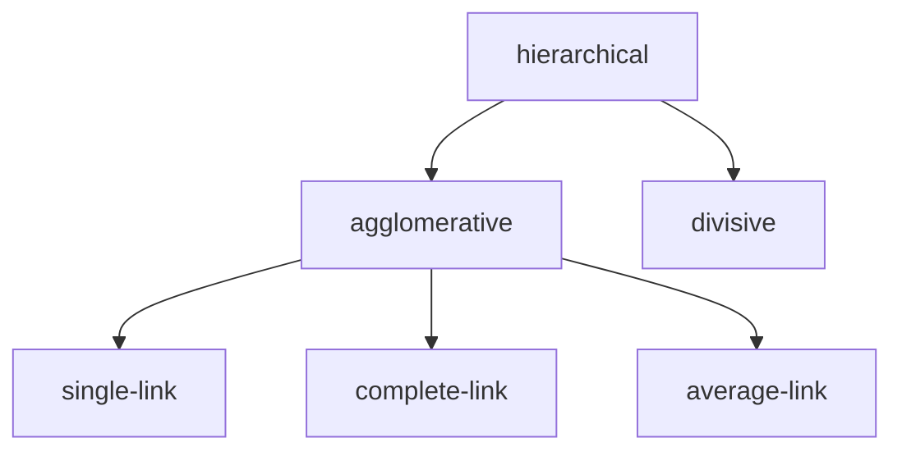

#unsupervised

Partitional clustering camp
- More efficient than hierarchical clustering. $O(Nd) < O(N^2\log(N))$

Hierarchical clustering camp
- Does not require the total number of classes, and have consistent result for every run.
- Can work directly on a distance matrix.

# Partitional Clustering

## K-Means Clustering

>[!question] Problem
>Given a set of unlabeled examples and $k$, split them into $k$ clusters and find the mean of each cluster.

The ideal formulation would be to minimise the distance between each example and their corresponding cluster's mean.

$$E(\{m_i\};S) = \sum_{\ell} \sum_i b_i^{(\ell)}||x^{(\ell)} - m_i||^2$$
$$b_i^{(\ell)} = \begin{cases}1&i=\arg\min_j ||x^{(\ell)}-m_j|| \\ 0 & \text{otherwise}\end{cases}$$
This is non-linear and requires an iterative algorithm to find a good solution.

![[Pasted image 20221204195615.png]]

### Elbow method to find k
![[Pasted image 20221204200001.png]]
We choose k=3.

### Drawbacks of k-mean

1. It is sensitive to initialization. Random initial mean could be too far away from the examples, and the update rules will having denominator of zero.
$$m_i = \frac{\sum_{\ell} b_i^\ell x^\ell}{\sum_\ell b_i^\ell}$$
2. Sensitive to outliers. This is a nature of mean. Then the resulting cluster mean cannot represent the majority of the cluster.
	1. k-Median: calculated on each dimension separate
	2. k-Medoid: no averaging when sample size is even
3. Difficult for data when clusters are of varying size and density
4. Bad for high-D data

# Hierarchical Clustering

## Agglomerative Hierarchical Clustering

Starting from examples each being a cluster, we find 2 closest clusters and merge them together, then we update the distance between all clusters, and repeat, until we are left with 1 cluster.

>[!Tips] Tie breaking
>We cannot break ties randomly as this will affect the final dendrogram structure. 

The problem then becomes how to define cluster distance.

### 3 Types of Proximity

1. Single-Link 
	1. the shortest distance between 2 points from each cluster
	2. tends to form elongated cluster
2. Complete-Link: 
	1. the longest distance between 2 points from each cluster
	2. tends to form small cluster
3. Average-Link: 
	1. the average distance between every pairs from each cluster
	2. middle between the two

### Distance matrix as input

We can perform dot product between every pair of examples to obtain a distance matrix.

### Natural Clusters
![[Pasted image 20221204202059.png]]
There are 2 natural clusters in this example.

