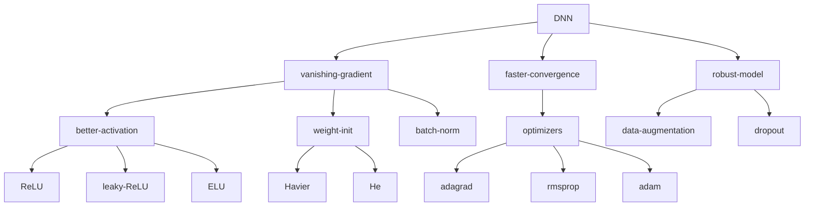
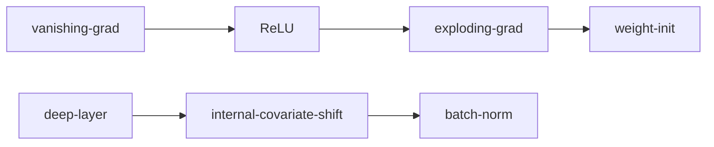
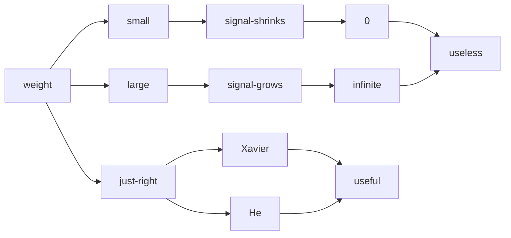

#machine-learning 

# Vanishing Gradient

## Nonsaturating Activation Functions

Sigmoid, tanh are saturating activation functions, instead, we need functions that slope will not go to zero as input size grow.
We therefore invented [[Rectified Linear Unit|ReLU]], [[Leaky ReLU]], [[Exponential Linear Unit|ELU]] to mitigate this problem.

## Weight Initialization

ReLU opens a door for exploding gradient.

We have 2 kinds of method to do initialization:
1. [[Xavier Initialization]]
2. [[He Initialization]]

## Batch Normalization

>[!Note] Internal Covariate Shift
>Distribution of the inputs of each layer changes during training as the network wegiths of the previous layers change.
>[In-depth explanation](https://blog.csdn.net/sinat_33741547/article/details/87158830)

In simpler words, that is the input of each layers are not independent and identically distributed. 

In learning phase, assume that upper flow weights are unchanged, but lower weights are updated, then its output also updated, then the upper weights need to adjust themselves. 

Dependency slower down the whole process.

Batch normalization is a great way to eliminate the dependency between output distribution and the layer weights.

### Procedures

Given a mini-Batch $B = \{x_i\}$
Need to learn $\gamma, \beta$.

First, get the mean and variance of the mini-batch:
$$\mu_\beta \leftarrow \frac{1}{m}\sum_{i=1}^m x_i$$
$$\sigma^2_\beta \leftarrow \frac{1}{m}\sum_{i=1}^m (x_i-\mu_\beta)^2$$
Then normalize the mini-batch:
$$\hat{x_i} \leftarrow \frac{x_i - \mu_\beta}{\sqrt{\sigma^2_\beta+\epsilon}}$$
- $\epsilon$ to avoid dividing by zero

Using the learnable parameter to transform the distribution
$$y_i \leftarrow \gamma \hat{x_i} + \beta$$

### Backpropagation for $\gamma, \beta$

Since we are doing [[Feedforward Neural Network#Stochastic Gradient Descent|SGD]], we are updating the parameters for each mini-batch. Therefore when doing backpropagation, $\hat{x_i}$ is available and can be used as derivative.

$$\frac{\partial L}{\partial \gamma} = \sum_i\frac{\partial L}{\partial y_i} \frac{\partial y_i}{\partial \gamma}
=\sum_i\frac{\partial L}{\partial y_i} \hat{x_i}
$$
$$\frac{\partial L}{\partial \beta} 
=\sum_i\frac{\partial L}{\partial y_i} \frac{\partial y_i}{\partial \beta}
=\sum_i\frac{\partial L}{\partial y_i} 
$$

# Robust Model

>[!Note] Robustness = Generalization
>Prevent overfitting.

