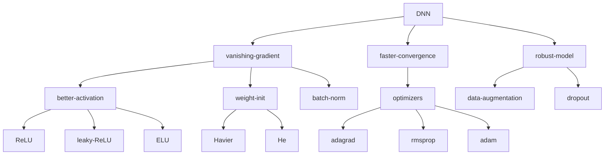

#machine-learning 

# Vanishing Gradient

## Nonsaturating Activation Functions

Sigmoid, tanh are saturating activation functions, instead, we need functions that slope will not go to zero as input size grow.

