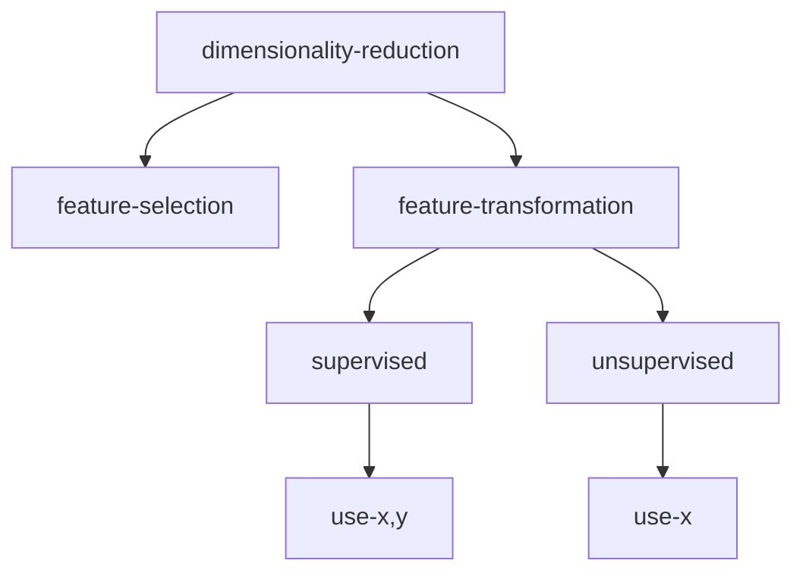
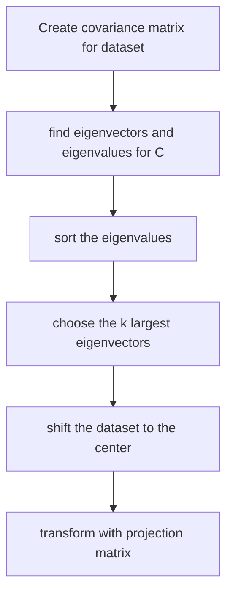

#machine-learning #unsupervised 

Reason for Dimensionality Reduction:
1. Reduce computational cost
2. Reduce overfitting
3. Easier visualization and interpretation

Feature selection:
1. Using final weight to filter away unimportant weights
2. Relevant but redundant features (highly correlated features, eg Image)

Feature transformation:
1. Choices of linear and non-linear
2. Reduction can be significant
3. For supervised learning: need to learn a mapping for each task, as "useful features" depends on which task it is performing
4. For unsupervised learning: only need to learn once, but not as task-specific as supervised, thus less accurate

>[!Note] PCA
>PCA is a feature transformation method for unsupervised learning.

# What component to choose?

![[Pasted image 20221205114623.png]]

By intuition, the axis in the graph can best explain the classification. What kind of attribute does it have? The answer is, the data points are having the largest variance on this direction.

Each projection is a filtering of information, we of course want to retain as much information as possible, for a fixed number of resulting dimension. Information is stored as variance.

>[!Note] Target
>To choose a vector such that after projection the dataset has largest variance.

Mathematically, let $x$ be the random vector following the probability distribution from which the dataset is drawn.
$$\max_w \text{Var}(w^Tx)$$

We can expand the formula
$$Var(w^Tx)=E[(w^Tx - E[w^Tx])^2]$$
$$=E[(w^Tx - w^TE[x])(w^Tx - w^TE[x])]$$
$$=E[(w^Tx - w^TE[x])(x^Tw - E[x]^Tw)]$$
$$=E[w^T(x - E[x])(x^T - E[x]^T)w]$$
$$=w^TE[(x - E[x])(x - E[x])^T]w$$

Now take a closer look at what is inside the expectation.

$$x - E[x] = \begin{bmatrix}x_1 - \mu_1 \\ \vdots \\ x_d - \mu_d \end{bmatrix}$$
$$\begin{bmatrix}x_1 - \mu_1 \\ \vdots \\ x_d - \mu_d \end{bmatrix}\begin{bmatrix}x_1 - \mu_1 & \cdots & x_d - \mu_d \end{bmatrix}$$
$$=\begin{bmatrix}
(x_1 - \mu_1)(x_1 - \mu_1) & \cdots & (x_1 - \mu_1)(x_d - \mu_d)\\ 
\vdots & & \vdots \\
(x_d - \mu_d)(x_1 - \mu_1) & \cdots & (x_d - \mu_d)(x_d - \mu_d)\\ 
\end{bmatrix}$$

Expectation of each term is the covariance between the feature i and feature j of the random vector $x$.

Therefore, we have
$$\max_{||w||=1} w^TCw$$
- note that we need to constrain the size of $w$ otherwise it will grow infinite.

This is a constrained optimization problem on which lagrangian would be useful.

# First Principal Component

Lagrangian is
$$L(w,\alpha) = w^T Cw - \alpha(w^Tw-1)$$
$$\frac{\partial L}{\partial w} = 2Cw-2\alpha w = 0$$
$$Cw = \alpha w$$
- Note that $\alpha$ is a scalar, therefore $w$ is an eigenvector of $C$.
- Since $C$ is a $d\times d$ matrix, it has $d$ eigenvalues.

We can also see that $\alpha$ IS the variance.
$$w^TCw = \alpha w^Tw = \alpha$$

Therefore to choose the best $w$, we just need to choose the $w$ with largest $\alpha$.

# Second Principal Component

Now we have found $w_1$, we go on and find $w$ which can maximise the remaining variance, that is variance not on the $w_1$ axis.

Then, $w_1$ and $w$ must be orthogonal.
$$w_1^T w = 0$$

The optimization problem becomes
$$\max_{||w||=1, w_1^Tw = 0} \text{Var}(w^Tx)$$

The Lagrangian is
$$L(w,\alpha,\beta)=w^TCw - \alpha(w^Tw-1) - \beta (w^Tw_1-0)$$
Solving 
$$\frac{\partial L}{\partial w} = 2Cw-2\alpha w - \beta w_1 = 0$$
$$2w^TCw=2\alpha w^Tw +\beta w^Tw_1 $$
$$2w^TCw=2\alpha (1) +\beta (0) $$
$$w^TCw=\alpha $$
$$Cw=\alpha w $$
Again we can obtain the same result, pick the $w$ with largest $\alpha$.

Since the first principal component is already chosen, we need to choose $w$ such that its $\alpha$ is the second largest among all solutions.

# Solving for k components

The final step involves a *projection matrix*, projecting the examples form original space to the reduced space.

To project to the new space, we need to shift the dataset to the origin, and then apply the transformation.

$$z_i = W^T(x_i - m)$$

$$W^T = \begin{bmatrix} 
w_{1_{1}} & \cdots & w_{1_{d}} \\
\vdots & & \vdots \\
w_{k_{1}} & \cdots & w_{k_{d}} \\
\end{bmatrix}$$

# Choosing k

$$PoV(k) = \frac{\sum_{i=1}^k \lambda_i}{\sum_{i=1}^d \lambda_i}$$

Then we set a threshold percentage (percentage of variance to be retained), and find the minimum $k$ satisfying the constrain.

# Possible Problems

## Unit
Comparing covariance between different dimension is unfair, as they might have different units.

The PCA algorithm will bias towards the high covariance dimension.

>[!Note] Standardization
>Therefore we need to preprocess the data so that it has zero mean and unit variance before the PCA. Alternatively, we can do PCA based on the correlation matrix instead.

## Complexity

Best known algorithm is $O(d^{2.376})$, generally is $O(d^3)$

