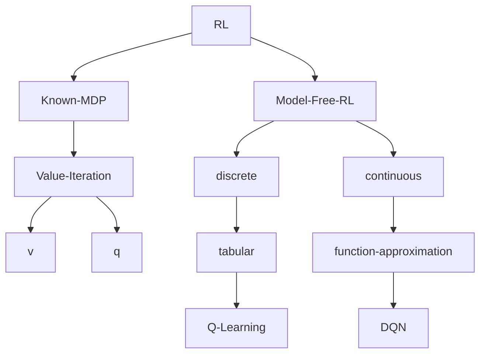

#machine-learning #reinforcement-learning 

>[!Tip] What kinds of problems does it solve?
>Reinforcement learning can solve sequential decision problems, which can be modeled as a [[Markov Decision Process| MDP]], where the solution to this problem would be an optimal policy $\pi^*$.

# Value function

There are two kinds of value function:
- [[State-value function]]
- [[Action-value function]]
The action-value function is more useful for unknown MDP problems. 

# Optimal Value Function

## Optimal state-value function
$$\forall s, v_*(s) = \max_\pi v_\pi(s)$$
Find a policy such that it can yield the highest expected return no matter starting at which state, the optimal state-value function describe the expected return of such policy.

## Optimal action-value function
$$\forall (s,a), q_*(s,a) = \max_\pi q_\pi(s,a)$$
Find a policy such that it can yield the highest expected return no matter starting at which state and action. The optimal action-value function describe the expected return of such policy.

# Optimal Policy

First, a policy can be fully described with a 2D matrix.

| $\pi$     | $a_1$    | $a_2$ |     
| ----- | -------- | ----- |
| $s_1$ | 0.5 | 0.5 |
| $s_2$ | 0.6| 0.4 |

Consider two policy, $\pi_1, \pi_2$, 
- if we have $v_{\pi_1}(s_1)>v_{\pi_2}(s_1)$:
	Then the row corresponding to $s_1$ of policy $\pi_1$ is preferred.
- if we have $v_{\pi_1}(s_2)<v_{\pi_2}(s_2)$:
	Then the row corresponding to $s_2$ of policy $\pi_2$ is preferred.

Then if we combine the $s_1$ row of $\pi_1$ and $s_2$ row of $\pi_2$, we can get $\pi_3$, which is better than both $\pi_1$ and $\pi_2$.

According to the [[State-value function#Matrix Form|derivation]], we know that there is a value upperbound for the optimal policy, that is once we have found that
$$v_\pi(s_i) = v_*(s_i)$$
Then we fix the $s_i$ corresponding row of $\pi$, and continue to improve other rows. At the end, we will come up with an optimal policy such that 
$$\forall i, v_\pi(s_i) = v_*(s_i)$$
Then we claim this policy is the *optimal policy*, $\pi^*$.

>[!Note] Properties of Optimal Policies
>1. There exists one or more than one optimal policies.
>2. They all can achieve the optimal state-value function.
>3. They all can achieve the optimal aciton-value function.
- How to prove the 3rd point?

# Bellman Optimality Equation

The meaning of those optimality functions is clear once you understand the [[Bellman Expectation Equation]].

Under optimal policy, they are making the best immediate decision.
$$v_*(s) = \max_a \left\{R^a_s+\gamma\sum_{s'}P^a_{ss'}v_*(s') \right\}$$
$$q_*(s,a) = R^a_s + \gamma \sum_{s'} P^a_{ss'} \max_{a'} q(s',a')$$

# Iteration Algorithm

Convergence is guaranteed in the following algorithms.

## Value Iteration Algorithm

### Based on state-value function
![[Pasted image 20221204190019.png]]
- Assuming knowledge of $R^a_s, P^a_{ss'}$.
### Based on action-value function
![[Pasted image 20221204190228.png]]
- Assuming knowledge of all possible $(s,a)$.

>[!Note] Problems
>Even we can estimate $q_*(s,a)$ without $P,R$, we still need to maintain a huge matrix of $q$. This isn't feasible when the $(s,a)$ space is unknown or large.

## Model-Free Reinforcement Learning

Advantages:
- no prior knowledge of $P,R$
- Using exploration and exploitation strategy

### Q-Learning Algorithm

![[Pasted image 20221204190656.png]]

>[!Tips] Sampling
>The principle behind this algorithm is sampling. Without knowing actual $P$ and $R$, we try to run into the same $(s,a)$ node again and again and see the outcoming $(s',r)$. When we collected enough data, we can estimate $R,P$.
>

This is called *temporal-difference* learning.
$$q(s,a) \leftarrow q(s,a)+\alpha [r+\gamma \max_{a'} q(s',a') - q(s,a)]$$
- $\alpha$ is the learning rate

#### $\epsilon$-Greedy Exploration

Somehow this concept is very similar to the [[trembling hand equilibrium]] in game theory.

Given current state $s$, greedy algorithm will tell us to choose $\arg \max_a q(s,a)$.

However, we need to at least try all actions, to conclude that $a$ is indeed the best. Kind of like the mutation in genetic algorithm.

Therefore, we leave a small chance that the agent will choose other actions "by mistake".

$$\pi(a|s) = \begin{cases} 
1-\epsilon\frac{m-1}{m} & a=\arg \max_a q(s,a) \\
\frac{\epsilon}{m} & \text{otherwise}
\end{cases}$$
- with $m$ possible actions

### Value Function Approximation

When the $(s,a)$ space is large, tabular method is impractical, we cannot store all the key-value pairs.

It is kind of like the size of a hash table is too big, you need to find alternative way to express the function $q$.

Since $q$ is a function, it can be represented by neural network!

$$\hat{v}(s;\vec{w}) \approx v_\pi(s)$$
$$\hat{q}(s,a;\vec{w}) \approx q_\pi(s,a)$$
- $\hat{v}, \hat{q}$ are some differentiable functions, with trainable parameters $\vec{w}$.

#### Deep Q-network

It is a combination of Q-Learning with CNN. The action-value function is approximated by a deep CNN.

It uses the following update rules for the weights:
$$w \leftarrow w + \alpha [r+\gamma \max_{a'} q(s',a';w) - q(s,a;w)]\nabla_w(s,a;w)$$

The temporal difference becomes the learning rate.