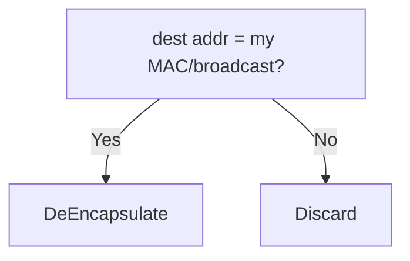
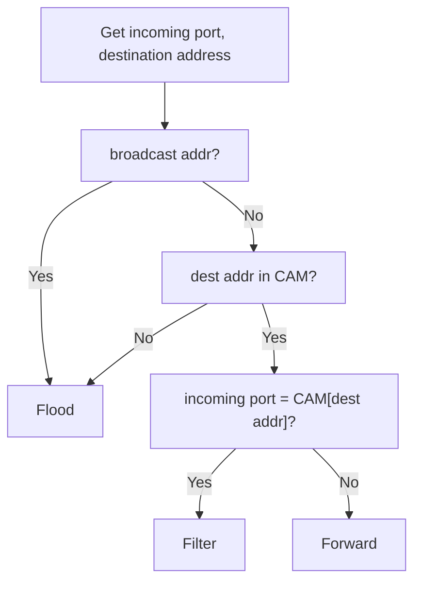
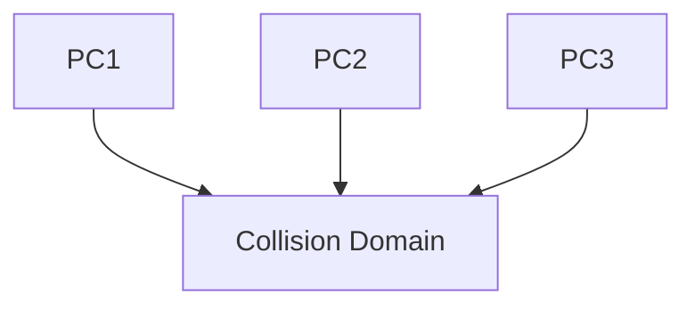
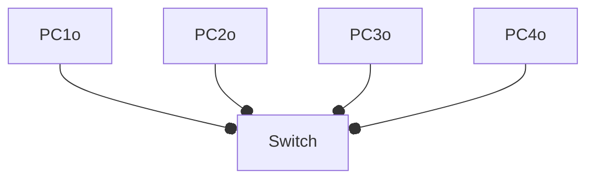
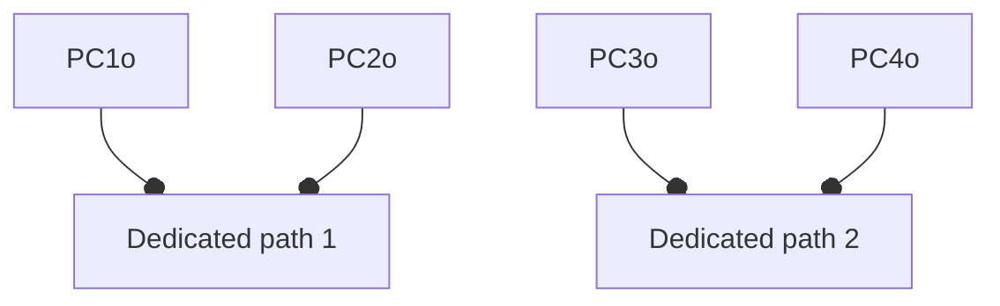
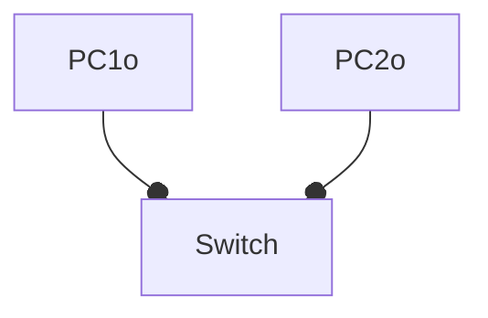
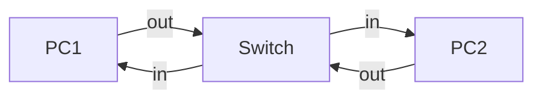
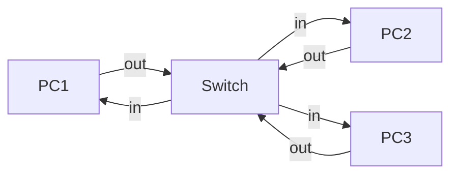

#networking

# LAN

A local area network is a network that has a boundary. Ethernet is the most commonly used technology to connect devices with a LAN, i.e., via switches. 

Alternatives:
1. token ring

# Hub

Hub is a layer 1 device used for regenerate signal.
It will flood whatever signals to all its ports, *except the incoming port*.
![[Pasted image 20221203123342.png]]

# MAC address

**Media Access Control** address.
- It is assigned to each *Network Interface Card*
- NIC is considered as layer 2
- 48 bits
- first 24 bits are *vendor code*
- last 24 bits are *device code*t

## Decision made by NIC

# Switch

Layer 2 device for creating multiple LAN segments, or collision domain. It can increase the bandwidth usage efficiency and achieve *microsegmentation*.

## MAC address table
Or CAM (Content Addressable Memory)

Each switch possesses a MAC address table, and is updated on receiving a new frame.

On receiving a new frame, we create or update entry:
1. Incoming port
2. Source MAC address
3. Current timestamp

Old entries will be cleared.

# Switch Operations

# Collision domain

**Collision**
When two devices send out signals on the same wire at the same time, the signal will deform.

> [!Note] Collision domain
> The area that collision may happen between all devices in it.

Examples:

- When PC1 and PC2 send out signals at the same time
- When PC1 and PC3 send out signals at the same time

## How switch separate collision domains?

> [!Tips] 3 methods
> 1. Dedicated paths
> 2. Full duplex
> 3. Buffering

### Dedicated paths
Consider a switch connected with 4 devices.

Assume that the CAM is empty.

Consider PC1 sends signal to PC2, PC3 sends signal to PC4, since CAM is empty, both signals will be flooded.

To avoid such collision, the switch will maintain dedicated paths between sender and receiver hosts.

Then it can be considered as:

### Full duplex
Consider a switch connected with 2 PCs.

Assume PC1 sends signal to PC2 and PC2 sends signal to PC1, then still collision will happen.

Therefore, each switch port has 2 parts, in and out, and the situation can be viewed as:

This avoids collision at the wires, but when there are more PCs, collision can still happens.

When full duplex is enabled:
- NICs/Interfaces can send and receive at same time
- [CSMA/CD](https://zh.wikipedia.org/zh-hk/%E8%BD%BD%E6%B3%A2%E4%BE%A6%E5%90%AC%E5%A4%9A%E8%B7%AF%E8%AE%BF%E9%97%AE) is no longer needed as collisions can't occur
- Full duplex cannot be used if a hub is plugged into the port

### Buffering

If PC2 and PC3 send signals to PC1 at the same time, collision can happen at the *in* wire to PC1.

Therefore, switch needs to hold either PC2's or PC3's signal, until the *in* wire is cleared. Thus, additional memory buffer is needed on the switch.

Simply maintain a FCFS queue on switch.

# Message types

## Unicast
1 to 1 communication. 

Frame header

| Src MAC | Dest MAC   |
| ------- | ---------- |
| My MAC  | Target MAC |

## Multicast
1 to many communication.

Frame  header

| Src MAC | Dest MAC |
| ------- | -------- |
| My MAC  | 01-00-5E-XX-XX-XX | 

## Broadcast
1 to all (in LAN) communication.

Frame header

| Src MAC | Dest MAC   |
| ------- | ---------- |
| My MAC  | All-1 MAC |

- This will be filtered by Router.

