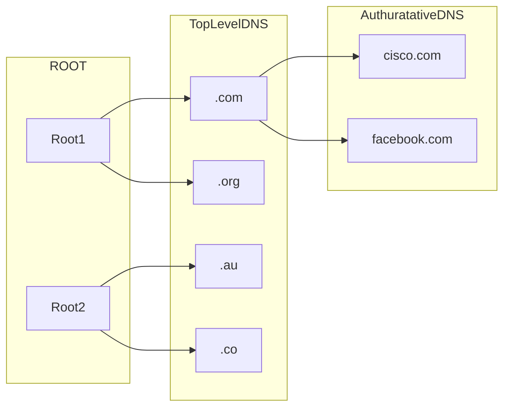
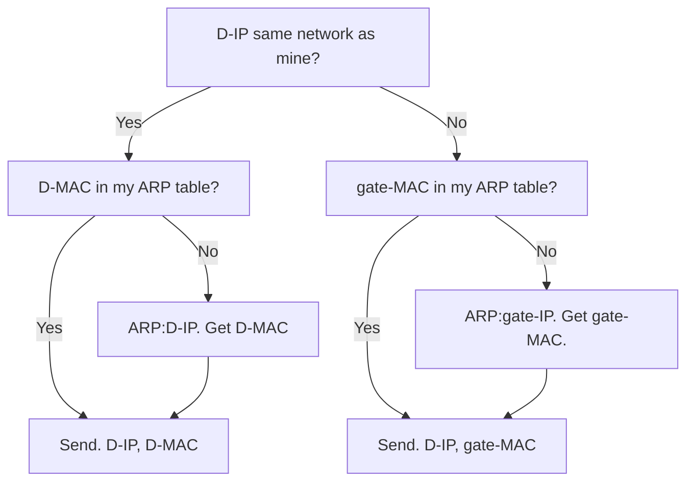

#networking 
![[mermaid-diagram-2022-12-03-155317.svg]]
These concepts are interconnected and definitely not linear. We shall start from the need for [[#router]] (separating broadcast domains), then talk about how the [[#routing table]] works. 

From routing table, we can see the importance of [[#network address]]. Then we introduce [[#IPv4 address structure]] including network part, host part, and [[#reserved addresses]]. On top of this, we come back to [[#Broadcast Address|broadcasting]] in layer 3.

Then we consider problems including: 
1. How to obtain IP address? [[#DHCP]].
2. How to send message to server in the same network? [[#DNS]] and [[#ARP]].
3. How to send message to server in different network? [[#NAT]].

Finally, we see how the routers learn the routing table and determine path. [[#RIP]] and [[#EIGRP]]. 

# Router

## Why do we need routers?

![[Pasted image 20221203161022.png]]
Without routers, all layer 2 broadcast messages will be passed to everywhere, jamming the whole Internet.

We want to separate the broadcast domain, such that only a specific group of host devices are subjected to the broadcast. Therefore, we have routers.

## Routing Table

The routing table has the following columns

| Source   | Network      | Interface   | Next Hop IP   | Metric   |
| -------- | ------------ | ----------- | ------------- | -------- |
| Protocol | Network Addr | name of inf | send to where | distance |

- Source indicates the type of the entry
	- C: directly connected
	- S: indirectly connected, i.e. separated
	- R: from RIP

For now, we can treat [[#network address]] just the same as [[#IPv4 Addresses Structure|IPv4 address]].

- By forward, it means the router will send the packet to the next hop address.

>[!Note] Network Address
>You might notice that the routing table would expand if each entry serves only one host. Instead, we can give IP address some structure and use a [[#network address]] to refer to all host devices within the same LAN!

## Router's Layer 2 Decision

Switch will flood all layer 2 broadcast messages, where destination MAC address is all-1.
However, routers will discard all incoming packets with all-1 destination MAC address.

>[!Note] Cross LAN Communication
>Never use a broadcast MAC address!

# IPv4 Addresses Structure

Address can be broken down into 2 parts:
1. Network 
2. Host

Depending on the initial byte, the division is different:

| First Byte        | Decimal | Class | Size | Network | Host |
| ----------------- | ------- | ----- | ---- | ------- | ---- |
| 00000001-01111110 | 1-127   | A     | 126  | 1       | 3    |
| 10000000-10111111 | 128-191 | B     | 64   | 2       | 2    |
| 11000000-11011111 | 192-223 | C     | 32   | 3       | 1    | 
| 11100000-11101111 | 224-239 | D     | 16   |         |      |
| 11110000-11111111 | 240-255 | E     | 16   |         |      |

>[!Tips] Class A special address
>127.x.x.x is reserved as loopback testing address.
>0.0.0.0 is reserved for DHCP.

>[!Note] Class D and E
>Class D is for multicasting groups, while class E is for research use, therefore it is meaningless to divide network and host part.

## Reserved Addresses

### Network Address
The host part is all-0. Used to indicate network in routing table.

### Broadcast Address

There are two kinds of broadcast address:
1. N.255 (always can be used)
2. 255.255.255.255 (only locally broadcast)

![[Pasted image 20221203172256.png]]

#### Broadcast to local network
Say 198.150.12.12 wants to send a broadcast message to 198.150.12.0:

Method 1: Use N.255.

| Src IP        | Dest IP        | Src MAC | Dest MAC      |
| ------------- | -------------- | ------- | ------------- |
| 198.150.12.12 | 198.150.12.255 | My MAC  | Broadcast MAC |
- Router will drop this packet at layer 2.
- Target PCs will accept this packet at layer 2.
- Target PCs will accept this packet at layer 3.

Method 2: Use 255.255.255.255.

| Src IP        | Dest IP        | Src MAC | Dest MAC      |
| ------------- | -------------- | ------- | ------------- |
| 198.150.12.12 | 255.255.255.255 | My MAC  | Broadcast MAC |
- Router will drop this packet at layer 2.
- Target PCs will accept this packet at layer 2.
- Target PCs will accept this packet at layer 3.

#### Broadcast to other network
Say 198.150.12.12 wants to send a broadcast message to 198.150.11.0:

Method 1: Use N.255.

| Src IP        | Dest IP        | Src MAC | Dest MAC |
| ------------- | -------------- | ------- | -------- |
| 198.150.12.12 | 198.150.11.255 | My MAC  | E1 MAC   | 
- Router will accept this packet at layer 2.
- Router can find the network in its routing table, accepted at layer 3
- Router will replace the dest MAC with Broadcast MAC.
- Target PCs will accept this packet at layer 2.
- Target PCs will accept this packet at layer 3.

Method 2: Use 255.255.255.255.

| Src IP        | Dest IP        | Src MAC | Dest MAC      |
| ------------- | -------------- | ------- | ------------- |
| 198.150.12.12 | 255.255.255.255 | My MAC  | E1 MAC |
- Router will accept this packet at layer 2.
- Router *CANNOT* find the network in its routing table, dropped at layer 3

>[!Question] Why do we need 255.255.255.255 then?
>What if you don't know the local network address? It is useful in DHCP.
>

# Obtain IP Address

If you first joined the network, how do you obtain your IP address? There are two general approaches:
- Static configuration
- DHCP

Static configuration is only useful when you know the network address, subnet mask, available addresses in the DHCP pool, default gateway and DNS.  

To connect to the Internet, we need 4 things:
1. IP adderss
2. Default gateway
3. Subnet mask
4. DNS IP address

It is impossible that we need to manually configure everything, here we introduce DHCP.

## DHCP

| Step        | Msg Type  | S-IP      | D-IP            | S-MAC      | D-MAC             | Payload                           |
| ----------- | --------- | --------- | --------------- | ---------- | ----------------- | --------------------------------- |
| Discover    | Broadcast | 0.0.0.0   | 255.255.255.255 | Host-MAC   | ff:ff:ff:ff:ff:ff |                                   |
| Offer       | Unicast   | Server-IP | Host-IP         | Server-MAC | Host-MAC          |                                   |
| Request     | Broadcast | 0.0.0.0   | 255.255.255.255 | Host-MAC   | ff:ff:ff:ff:ff:ff | choice of IP                      |
| Acknowledge | Unicast   | Server-IP | Host-IP         | Server-MAC | Host-MAC          | Subnet mask, default gateway, DNS |

- Send to port 67, Receive on port 68

>[!Tips] DHCP ACK
>Only the accepted DHCP server need to response.

### DHCP relay

Noticing that the DHCP discover and request message are layer 2 broadcast messages, which will be blocked by a router. What if the DHCP server is not in the same network? We need something called DHCP relay.

We can configure a router to forward a DHCP broadcast message (can be identified by Source IP) to a specific address.

This DHCP relay agent will change the IP header into the following

| S-IP                            | D-IP                                   |
| ------------------------------- | -------------------------------------- |
| Interface of the source network | Receiving interface of the DHCP Server |

The DHCP server will send the offer  packet back to the relayer

| S-IP                                   | D-IP                            |
| -------------------------------------- | ------------------------------- |
| Receiving interface of the DHCP Server | Interface of the source network |

The DHCP relay agent will again change the IP header into the following

| S-IP                            | D-IP            |
| ------------------------------- | --------------- |
| Interface of the source network | 255.255.255.255 |

Mac Header

| S-MAC                           | D-MAC             |
| ------------------------------- | ----------------- |
| Interface of the source network | ff:ff:ff:ff:ff:ff | 
- Note that the Destination IP of the Offer is no longer the assigned IP address to the host.

# Address Resolution

Suppose there is a Google server, located at the same network as you. You want to send a message to it.

*What you required*:
1. Destination IP
2. Destination MAC

## DNS (Get IP)

DNS server stores simple key-value pair. The key is domain name, the value is the IP address. They run over UDP on port 53.

### DNS hierarchy
Just like computer multi-level cache, so as DNS servers.

### Local DNS Server
The ISP owned DNS server which does not belong to the hierarchy, which is also the DNS server assigned to a host during DHCP. When client make a DNS request, the request is first sent to the ISP DNS, and then it will act as a proxy.

### Mixing Recursive and Iterative 1
![[Pasted image 20221209141915.png]]
- TLD DNS Server does not necessarily know Authoritative DNS Server. For example, under `dns.umass.edu`, there is a set of department DNS Server (authoritative). One more iteration is needed.
- `dns.nyu.edu` cache response for every query it made. 
- Query 1 is recursive, others are iterative.
- Caching information is discarded time to time (2 days).

### Fully Recursive
![[Pasted image 20221209142601.png]]
- see [wiki](https://en.wikipedia.org/wiki/Domain_Name_System#Address_resolution_mechanism) for more details

## ARP (Get MAC)
In the middle of the link and network layer.

### ARP Table
A mapping between IP address and MAC address, recorded devices connected to the same LAN.

1. IP
2. MAC
3. Timestamp

Each entry should not last long (IP address is not fixed), and will be deleted in a few hours.

### Sending message to D-IP

>[!Note] Using default gateway MAC when D-IP is not in the same subnet
>It is because the layer 2 NIC will discard the frame when the destination MAC is neither itself nor broadcast address.
>
>When the router receives the frame, it will pass it up to layer 3. Then it will look at the routing table and determine the correct interface to send the re-encapsulated frame.

### ARP process

| Step    | Msg Type  | S-IP      | D-IP      | S-MAC      | D-MAC             | 
| ------- | --------- | --------- | --------- | ---------- | ----------------- | 
| Request | Broadcast | Host-IP   | Server-IP | Host-MAC   | ff:ff:ff:ff:ff:ff |         
| Reply   | Unicast   | Server-IP | Host-IP   | Server-MAC | Host-MAC          |         

Notice that the ARP request is a layer 2 broadcast message, which will be discarded by router.

>[!Note] Everyone who received ARP request will update ARP Table?
>No! Only the targeted server will update the ARP Table! Layer 2 will de-encapsulate the frame and pass it up to the ARP module, which will look at the IP address and discard if unmatched.

### Sending across subnet

Network topology:

The ARP process:

| Step        | Msg Type  | S-IP                 | D-IP                 | S-MAC      | D-MAC             |
| ----------- | --------- | -------------------- | -------------------- | ---------- | ----------------- |
| ARP Request | Broadcast | Host-IP              | Default Gateway R1-L | Host-MAC   | ff:ff:ff:ff:ff:ff |
| ARP Reply   | Unicast   | Default Gateway R1-L | Host-IP              | R1-L-MAC   | Host-MAC          |
| ICMP        | Unicast   | Host-IP              | Server-IP            | Host-MAC   | R1-L-MAC          |
| ARP Request | Broadcast | Default Gateway R1-R | Server-IP            | R1-R-MAC   | ff:ff:ff:ff:ff:ff |
| ARP Reply   | Unicast   | Server-IP            | Default Gateway R1-R | Server-MAC | R1-R-MAC          |
| ICMP        | Unicast   | Host-IP              | Server-IP            | Host-MAC   | R1-L-MAC          |
| ICMP        | Unicast   | Host-IP              | Server-IP            | R1-R-MAC   | Server-MAC        |
| ICMP        | Unicast   | Server-IP            | Host-IP              | Server-MAC | R1-R-MAC          |
| ICMP        | Unicast   | Server-IP            | Host-IP              | R1-L-MAC   | Host-MAC                  |

# Public vs Private Network

Devices connected together are required to have unique IP address. But if they are not connected, they don't need to.

Therefore, we might find the same address being used across many private networks, however, remains unique within their own network.

Can we keep the same practice even if private networks are connected to the Internet? Yes, router will automatically discard private address.

| Class | Range of Network Address  | Size |
| ----- | ------------------------- | ---- |
| A     | 10.0.0.0                  | 1    |
| B     | 172.16.0.0-172.31.0.0     | 16   |
| C     | 192.168.9.9-192.168.255.0 | 256  | 

## Network Address Translation

This is performed by the immediate router connected to the ISP.
Purchase public addresses from the ISP.
When the edge router sees traffic, it performs a 1 to 1 translation.
*Port address translation* can do 4000 to 1 translation, greatly reduce the no. of public addresses we need.

![[Pasted image 20221203205047.png]]

# Routing Protocols

Routing protocols governs how the routers dynamically learn the [[#routing table]].

>[!Tips] Routed protocols
>They help direct user traffics. IP is one of them.

## RIP protocol

Routers send RIP Update messages regularly, say every 30s.

### Metric
Number of hops to that network, that is, how many routers needed to pass through during the trip.

Metrics of other protocols

| Protocol | Bandwidth | Delay   | Link loading | Link error rate |
| -------- | --------- | ------- | ------------ | --------------- |
| IGRP     | Default   | Default | O            | O               |
| EIGRP    | Default   | Default | O            | O               | 

>[!Note] Bandwidth
>Only consider the link bandwidth, instead of the sending bandwidth.
>Consider the slowest link over the path!

### RIP Update
![[Pasted image 20221203211235.png]]
This is an example of RIP Update message.

### When receiving RIP Update

### When long no receiving RIP Update from best path

This can happen on topology change
- Delete the entry
- Update the table with RIP Updates from other paths

