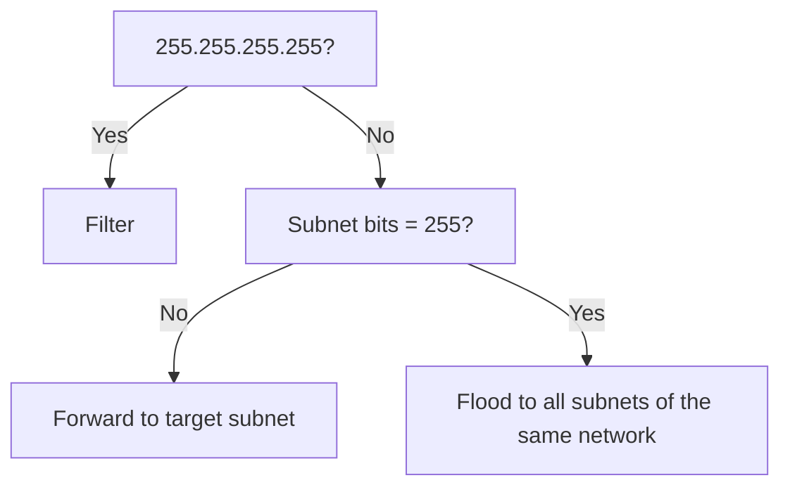

#networking 

# Subnet bits

Network administrator can decide to borrow how many host bits as subnet bits.

![[Pasted image 20221203222727.png]]

# Subnet mask

All-1 except the host bits.
Slash representation.

# Identify N.S.H

```mermaid
flowchart TB
	Class --> A
	Class --> B
	Class --> C
	A --> N=1
	B --> N=2
	C --> N=3  
	N=1 --> s["subnet mask"]
	N=2 --> s["subnet mask"]
	N=3 --> s["subnet mask"]
	s --> S,H	
```
[[Internet Protocol#IPv4 Addresses Structure]]

# Subnet Reserved Address

Original definition of reserved address, without subnetting:
[[Internet Protocol#Network Address]]
[[Internet Protocol#Broadcast Address]]

With subnetting, those definitions need to be updated:

## Subnetwork Address
All-0 in the Non-subnet, host bits.
Can be calculated using ANDing.

## Subnet Broadcast Address
All-1 in the Non-subset, host bits.


