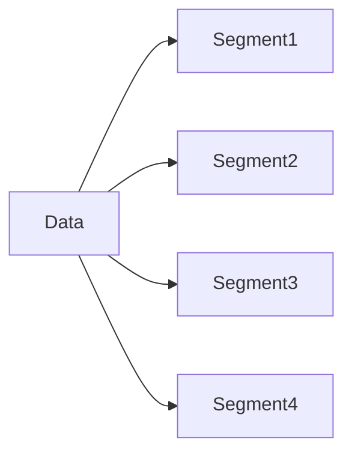
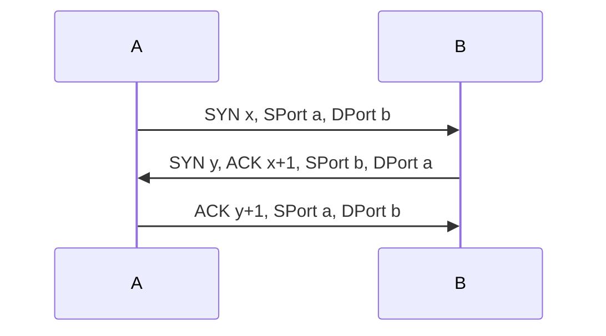
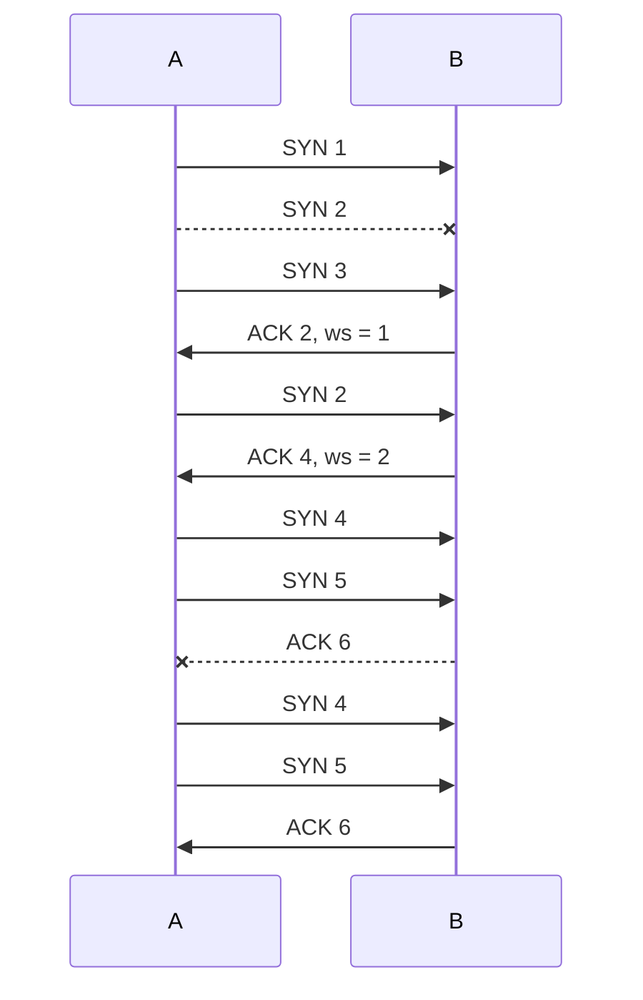
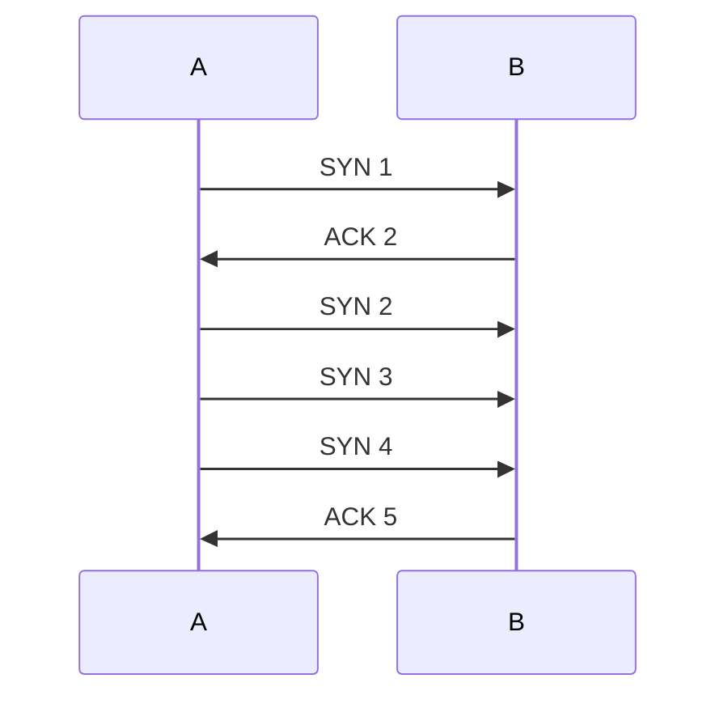

#networking 

There two main protocols:
1. TCP
	1. HTTP
	2. FTP
	3. SMTP
	4. Telnet
2. UDP
	1. [[Internet Protocol#DHCP|DHCP]]
	2. [[Internet Protocol#DNS (Get IP)|DNS]]
	3. SNMP
	4. TFTP
	5. VolP
	6. IPTV

# TCP

## Properties
- Reliable
- Error Detection: Acknowledge
- Error Correction: Retransmission
- Sequencing

## Sequencing

Data from Application Layer is often too big for the IP protocol packet. 

Sending order $\ne$ Receiving order, therefore we have sequence numbers.

## Three-way Handshake

Using three-way handshake can ensure both sides are awaring of the message.

- Sequence numbers are randomly chosen.

## Acknowledge

When the receiver does not send ACK in time, data will be retransmitted.
To retransmit right segment, there is a retransmission queue.
The retransmission queue is cleared once an ACK is received.

Retransmission examples:

## Multiplexing with Ports

Ports are used to identify which process does this message belongs to.
TCP Software is responsible for feeding the message data to correct process.

>[!Note] Demultiplex
> Delivering data from the transport layer to the correct port process.

### Well-Known Ports
- Numbers below 1024
- Defined by Internet Assigned Number Authority
![[Pasted image 20221203220347.png]]

### Registered Port
- 1024 to 49151
- For applications use

### Dynamic or Private Ports
- 49152 to 65535
- Dynamically assigned to applications

## Flow control with window size

Windows size = number of segments per ACK
Every process has a network io buffer. When the process is running slow, the buffer can be full. Then it needs to adjust the window size in time.

E.g. windows size = 3

# UDP

## Properties
- Fast
- Unreliable

## Port
Same as TCP.